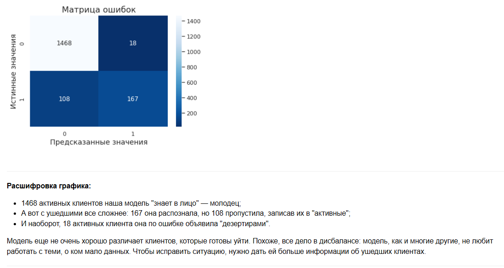

# Клиент под контролем  
### Прогноз оттока клиентов телеком-компании (Выпускной проект Яндекс.Практикум)

Проект решает задачу бинарной классификации: **прогноз оттока клиентов** оператора связи «ТелеДом».  
Модель на основе **CatBoostClassifier** показывает **точность ~93%** на тестовых данных.

Цель проекта — построить модель, которая поможет маркетологам своевременно выявлять клиентов, склонных к уходу, и предлагать им персональные условия.

### 🚀 Основные результаты
- Лучшая модель: **CatBoostClassifier**
- Метрика на тесте: **Accuracy ≈ 0.93**, **ROC-AUC ≈ 0.91**
- Важнейшие признаки: длительность договора, общие расходы клиента, тип подписки.

### 📊 Превью результатов

### 🛠 Технологический стек
- **Python 3.9.5**
- **Библиотеки**: pandas, numpy, matplotlib, seaborn, plotly, scikit-learn, catboost
- **Jupyter Notebook**

### 📓 Ноутбук проекта
Полный анализ с исследовательским анализом данных (EDA), предобработкой, обучением моделей и выводами:

[Открыть ноутбук с интерактивными графиками (nbviewer)](https://nbviewer.org/github/Dayana373/Portfolio_Yandex/blob/4518223c1509ffa941e87acc8017c1c75f7f97b1/final_project.ipynb)

[Открыть ноутбук напрямую на GitHub](https://github.com/Dayana373/Portfolio_Yandex/blob/main/final_project.ipynb) (Единственный нюанс — графики Plotly в GitHub не отображаются)

### 📁 Данные
Данные предоставлены Яндекс.Практикумом:

[Скачать датасет](https://disk.yandex.ru/d/8hb_9fAZatuyMw)

### 👩‍💻 Автор
Диана Сергеева  
Data Scientist | Выпускница Яндекс.Практикум  
GitHub: [@Dayana373](https://github.com/Dayana373)

